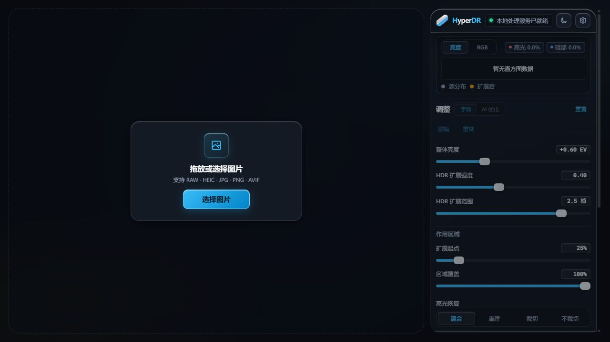
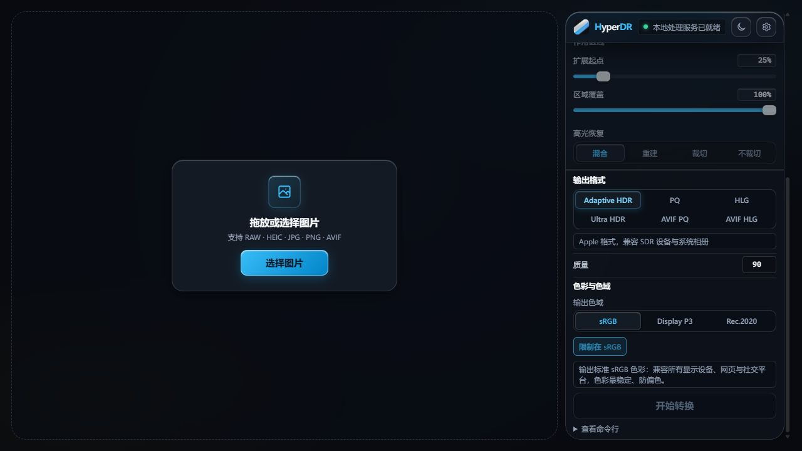
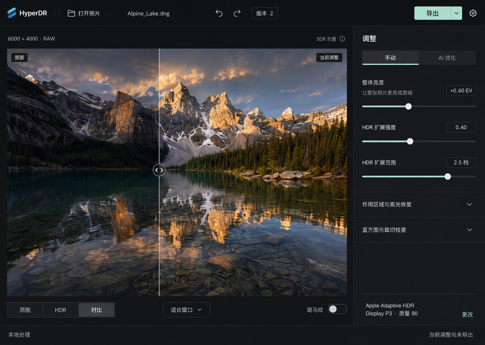

# HyperDR 暗房工作台：桌面前端设计方案

日期：2026-09-05。交付：一套新设计、一张主界面概念图、现版界面截图与对比。尚未修改产品前端代码。

## 设计结论

把现在“照片 + 整列参数”的布局重组为“全局工具栏 + 摄影画布 + 精简调整栏 + 按需打开的导出/版本抽屉”。继续服务一次精修一张照片的流程。照片依然是主体，常用操作拥有稳定位置。

核心收益是减少滚动寻找、分清当前调整与导出结果、让格式选择更容易理解。界面改版本身不提高 HDR 画质、运算速度或设备兼容性。

## 现版依据与观察范围

桌面 README 确认 Tauri 外壳使用 apps/panel/web 同一套前端。本次启动本地桌面模式服务，在应用内浏览器 1280×720 视口检查实际页面。捕获的是空白工作台及滚动后的输出区；未导入用户照片、未完成真实转换，未验证 Tauri 原生标题栏或显示器 HDR 输出。

1. 初始工作台：导入入口明确，主次布局合理；没有照片时仍展示大量不可用参数。
2. 滚动至输出：格式、质量、色域可用相邻分组理解，但主要调整项已离开视野。实测右栏可视高度 684px、内容高度 1110px，初始“开始转换”按钮顶部约为视口 y=1053px，需要滚动才能到达。这个测量仅代表此次空状态与窗口尺寸，不泛化为所有编辑状态。

源码交叉核对：
- apps/desktop/README.md：桌面壳与面板关系。
- apps/panel/web/index.html：调整、格式与色域的结构。
- apps/panel/web/css/shell.css：整个右栏滚动，标题区域吸顶。
- apps/panel/web/js/preview/stage.js：已有分屏、按住比较与预览视图。
- apps/panel/web/js/run/export-history.js：已有版本选择与“使用这版参数”。
- apps/panel/README.md：单张编辑、恢复、撤销与输出能力。

保留现版已有的能力，不将它们包装成改版新增功能。截图不能证明完整无障碍合规或真实 HDR 保真。

## 新主页面

图片通过内置 ImageGen 生成，属于设计概念和模拟照片，不是可交互原型，也不是实际 HDR 效果对比。目标设计画布为 1440×1024，生成图的实际尺寸可能不同。

### 全局工具栏

顶部约 48px：品牌、打开照片、当前文件名、撤销/重做、版本入口、导出、偏好设置。只有“导出”为强强调主按钮。按钮始终固定，不随右栏内容滚动。

打开新照片仍替换当前照片，不引入素材库。没有照片时禁用导出、收起调整内容，画布中央仅展示选择/拖入入口及格式说明。

### 照片画布

中性深灰底，图片四周保留适量空间。上方提供文件元信息和实际预览状态；下方专用工具条放置原图/HDR/对比、缩放、斑马纹。工具不遮盖像素内容。

“SDR 示意”与“真 HDR 预览”根据现有检测结果展示，不因点击 HDR 视图就宣称具备真 HDR。分屏原图对比沿用当前语义，不混称为标准化 SDR/HDR 测量。

### 右侧调整栏

默认宽度 320px，面向 1280×720 及更大桌面窗口。正文 14–16px，采用系统中文无衬线字体；数值使用等宽数字。

手动模式默认展开整体亮度、HDR 扩展强度、HDR 扩展范围；“作用区域与高光恢复”和“直方图与裁切检查”默认折叠，可固定展开供熟练用户使用。复用现有 AI 模式及其后置微调逻辑，不假定新增模型能力。

控制区独立滚动，底部始终保留输出摘要，如“Apple Adaptive HDR · Display P3 · 质量 90”。概念中的数值只是演示，不修改现版默认设置。点击“更改”打开输出抽屉。

### 导出抽屉

在右侧替换调整内容，画布保持可见。先选用途，再展示真实编码名称：
- Apple 相册：Adaptive HDR。
- Ultra HDR 照片：Ultra HDR JPEG。
- 指定 HDR 工作流：PQ、HLG、AVIF PQ、AVIF HLG。

用途标签只是帮助理解现有格式，不承诺所有设备和应用都支持 HDR。保留现有能力说明、色域选择、质量参数及可选高级项。切换格式仍按现有规则限制 HDR 扩展范围；发生调整时在范围读数旁提示。

“导出”先打开抽屉确认配置，再由“开始导出”运行；熟练用户可用按钮菜单中的“按当前设置导出”。转换与保存沿用现有两步能力，不承诺尚不存在的自动保存路径功能。成功后展示“保存到设备”和“继续调整”。

### 版本抽屉与状态

顶部“版本”打开当前照片的导出记录。列表采用轻量分隔行，呈现版本编号、格式、时间和参数摘要。明确区分“下载此版本”与“使用这版参数”；查看旧版本不能悄悄覆盖当前调整。

首期继续复用现有版本数据。旧版成品像素预览、缩略图生成或两版成品视觉比较需额外能力，不作为纯布局改版的既定交付。

底部状态条区分：未导出、正在导出、导出成功、已调整需重新导出、失败。正在导出时提供取消；失败保留先前成功版本。状态用文字和图标共同表达，不只靠颜色。

## 与现版比较

| 方面 | 现版 | 新方案 | 预期改善 |
| --- | --- | --- | --- |
| 主操作 | 开始转换在长右栏底部 | 导出入口固定在顶栏 | 不必滚到底寻找入口 |
| 参数负担 | 常用与高级调整纵向展开 | 三个常用参数优先，其余按需展开 | 减少首屏决策量 |
| 输出设置 | 六种格式、质量和色域常驻右栏 | 摘要常驻，详细选择进入抽屉 | 调整画面时更专注 |
| 版本管理 | 结果区下拉选择历史版本 | 独立列表，区分下载与恢复参数 | 更容易理解当前编辑与旧版结果关系 |
| 视觉语言 | 蓝色玻璃面板、发光描边、大圆角 | 实色中性灰、细分隔、低饱和强调色 | 降低装饰元素对照片注意力的争夺 |
| 空白状态 | 参数与空白直方图同时占屏 | 单一导入入口，载入后显示调整栏 | 下一步更明确 |
| 预览工具 | 已有视图切换、分屏、缩放 | 收束到照片下方固定工具条 | 能力入口更一致，减少遮挡 |
| 状态反馈 | 服务状态、结果与日志分散 | 服务收敛到状态栏，输出状态清晰标记 | 更容易区分“当前调整”和“已导出版本” |

## 取舍

- 顶部工具栏与底部状态条会占用少量照片高度，不能宣称预览面积在所有照片比例下都增大。
- 折叠直方图和高级参数会给重度用户增加一次操作；允许固定展开且保留偏好。
- 用途式导出增加一个选择层级；提供按当前设置导出的快捷路径。
- 单张精修定位维持不变。批量队列、相册库和跨图复制参数属于独立产品扩展，本方案不依赖它们。
- 中性画布的收益是视觉组织上的设计判断，不等于经过测量的色彩准确度提升。
- 暂无用户测试，不能给出节省时间百分比、满意度增长或生产效率倍数。

## 落地顺序与验收

优先实现常驻导出入口、右栏分组和输出抽屉，再整理版本入口及视觉样式。现有预览、调整历史与转换逻辑继续复用，无需为设计重写桌面壳。

在 1280×720 检查：导出入口无需滚动；默认常用三个参数完整可见；展开高级参数不会推走导出入口；输出摘要不被滚动遮挡；不出现页面横向滚动。然后按真实流程验证：打开照片 → 调整/比较 → 导出 → 保存 → 继续调整 → 选择旧版/恢复参数。用现有项目检查配合这条流程即可，不为样式变动新增大量实现镜像测试。

本次只交付设计提案，下一阶段可将其做成桌面交互原型。
