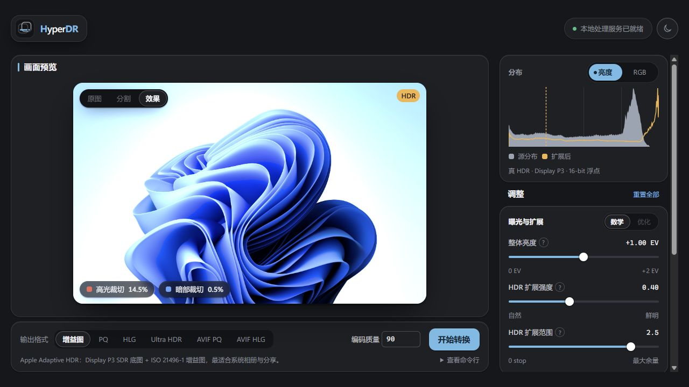
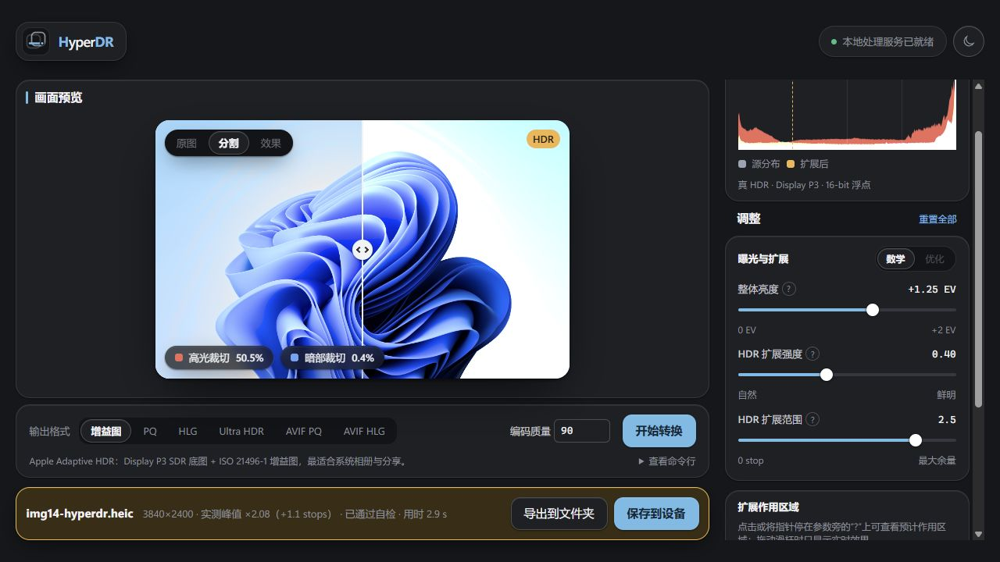
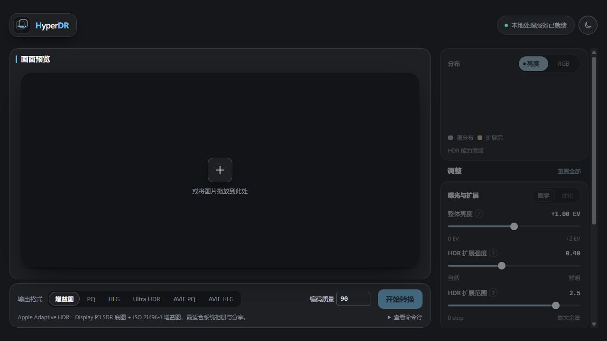
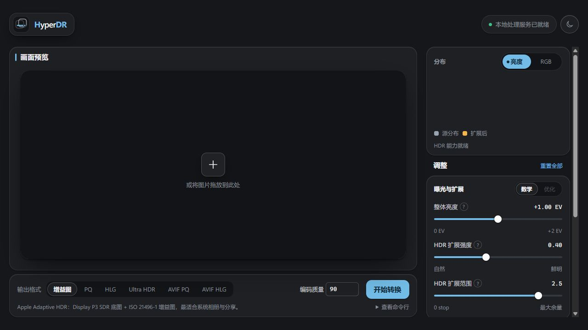
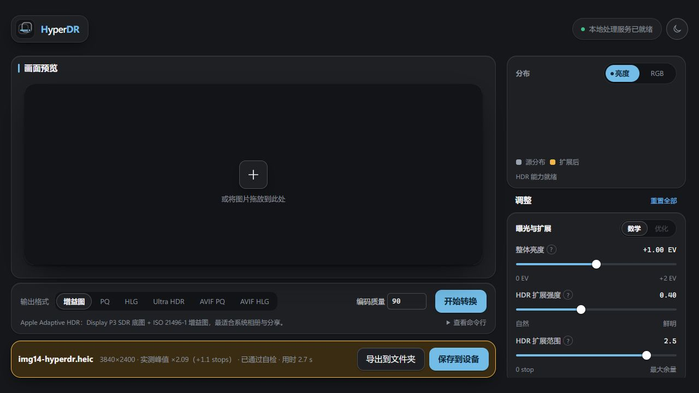
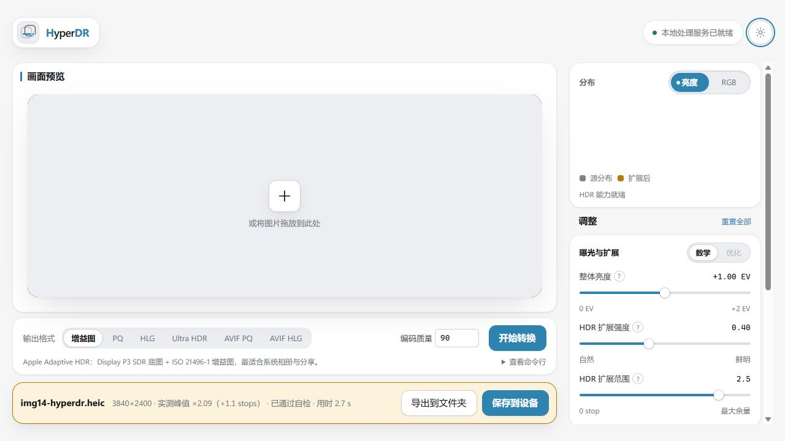
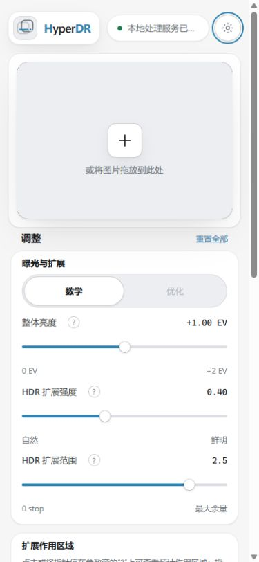
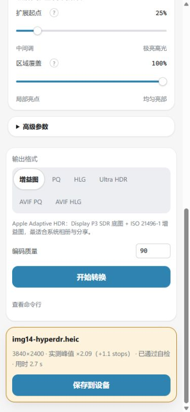

# HyperDR 前端面板审查

- 日期：2026-08-13
- 审查版本：`ebcb341`
- 范围：桌面与手机布局、图片选择、预览、参数区、主题、转换结果、基础可访问性、前后端契约
- 原审查结论：图片上传后的实时预览被前端 `ReferenceError` 完全阻断；转换后端仍可完成任务。
- 修复状态：**上传与预览阻断已修复并完成真实流程复测。** 其余对比度与手机状态文案问题仍按原优先级保留。

## 修复验证

- 删除了 HDR 原生浮点预览迁移后残留的 `displayMapped` 调用和旧显示缓冲字段。
- 清理了直方图分析中残留的 `scene` / `sceneScale` 路径，改为直接比较原生 SDR 底图与已渲染 HDR 平面。
- 真实 JPEG 已验证：上传、HDR 画布、亮度/RGB 直方图、原图/分割/效果切换、调参重载均正常。

- 将整体亮度调至 +1.25 EV 后预览保持可用，裁切统计随新帧更新。
- Adaptive HDR 转换成功，3840×2400 输出通过自检，浏览器控制台无错误或警告。

## 流程证据

### 1. 桌面空状态 — 健康

- 1280×720 下信息层级清楚，预览、调整和输出三块关系明确。
- 未选图片时参数区被禁用，输出格式仍可预先浏览。
- 服务状态、主题切换和图片选择均有可访问名称。

### 2. 选择图片并生成预览 — 阻断

- 图片上传成功，但 `apps/panel/web/js/preview/stage.js:447` 调用了不存在的 `displayMapped`。
- 该函数在当前提交中被删除，但旧调用仍保留。`image.display` 已没有其他使用点，因此这是 HDR 预览迁移遗留的死引用。
- 异常被 `load()` 捕获后传给 `clear()`；错误文字只写入 `.visually-hidden` 的 `stage-title`，视觉上仍是普通空状态，没有持久错误说明。
- `store.file` 已写入，参数与“开始转换”随之解锁，因此用户会在没有预览的情况下调参或转换。

### 3. 无预览情况下转换 — 部分健康

- 使用测试图片完成了真实 Adaptive HDR 转换，生成 3840×2400 HEIC，并通过自检，用时 2.7 秒。
- 结果卡、峰值、验证状态、桌面导出与设备保存动作完整。
- 但核心承诺是“边看实时预览边调参”；当前只能盲调，主流程不能判定为正确。

### 4. 浅色主题 — 基本健康，有对比度风险

- 主题切换正确，主要控件和分组边界清楚。
- 结果元信息为 13px 普通文字；实测对比度约 4.38:1，低于 WCAG AA 常规文字所需的 4.5:1。

### 5. 手机顶部布局 — 基本健康

- 390×844 下无横向溢出，预览、参数和 44px 滑杆触控区域能够正常重排。
- 服务状态被截断为省略号，且就绪状态没有 `title`，视力用户无法读取完整文本；可改成更短的“服务已就绪”。

### 6. 手机输出与结果 — 健康

- 输出格式自然换行，主要 CTA 满宽，结果卡能完整呈现。
- 触屏环境正确隐藏桌面文件夹导出，只保留“保存到设备”。
- 深色主题结果元信息对比度约 4.27:1，同样低于 4.5:1。

## 优先级建议

1. **已完成：修复预览死引用。** 已删除遗留赋值及同批迁移留下的 `scene` 分析路径，并完成真实上传复测。
2. **补端到端烟雾测试。** 用一张小型 JPEG 覆盖“新建会话 → 上传 → `/api/preview` → 画布显示 → 转换结果”，并断言舞台获得 `has-image`。现有字符串契约和语法检查无法发现未定义标识符。
3. **修复错误恢复。** 增加可见、持久的预览失败状态，并明确决定是否允许无预览转换；若允许，应将参数区标为“未预览”。
4. **提高结果元信息对比度。** 对 `.result-meta` 使用更强的文字色，分别确保浅色与深色结果卡背景上至少 4.5:1。
5. **缩短手机服务文案。** 避免 390px 宽度下关键状态被截断。

## 自动化检查

- `scripts/check_panel_roles.py`：49 个角色声明、44 个角色读取，全部匹配。
- 19 个前端 JavaScript 文件：`node --check` 全部通过。
- 面板定向测试：78 passed，另有 4 个 subtests passed。
- 全量 Python 测试：142 passed、4 skipped、1 failed。唯一失败来自 macOS T2 固定素材的 `heif_encoder.cpp` 源码指纹不匹配，与本次前端缺陷无关，但仍应在发布前更新或确认 fixture manifest。

## 证据限制

- 未在真实 HDR 屏幕、Safari/iPhone、触控硬件或屏幕阅读器上验证。
- 截图与 DOM 可确认可见布局、标签和部分对比度风险，但不能证明完整 WCAG 合规。
- 由于实时预览在所有上传图片上被同一异常阻断，原图/效果/分割视图、直方图、遮罩、全屏预览和优化模式无法继续做有效视觉审查。
