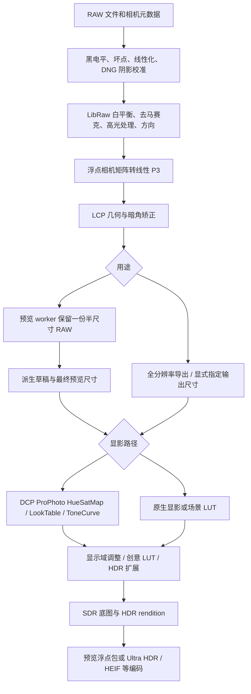

# 图像管线审核与优化：2026-09-21

本次主要问题是预览重复解码，以及镜头矫正的插值质量。DCP 增加了颜色计算，
但它本身没有空间模糊操作。没有证据支持把所有“发糊”都归因于 DCP。
当前修改采用可量化的 CPU 优化，没有更换 RAW 解码器或加入默认锐化。

## 管线与职责



预览在显影前缩小场景图像以控制计算量，因此不能承诺它与全尺寸显影后再缩小逐像素相同。
原生 RAW 显影、DCP 显影与已经显影的 JPEG/HDR 输入仍保留各自的颜色语义。
没有把 DCP ToneCurve 再交给原生场景曲线显影一次，也没有用缩小增益图来掩盖 RGB 细节损失。

## 确认的问题与修复

1. **不同预览尺寸重复 RAW 解码。** `PreviewSession` 原先只缓存两个最终尺寸。
   `preview_max_edge` 进入解码 key，而 LibRaw 对所有 fast preview 都产生相同半尺寸图像，
   改边长仍会重新 unpack、处理、矩阵转换和 LCP。现在 worker 以实际 RAW 参数保存一份 master，
   从中派生尺寸；两份尺寸级图像继续保存分析和模型缓存。DCP、LCP、RAW 参数和源文件仍参与身份检查。
   尺寸级磁盘缓存继续读写，命中时不强制构造 master。大中间图不落盘，非 RAW、独立 preview-frame
   和完整导出的解码策略保持原有语义。

2. **LCP 双线性插值削弱细节。** 改为 4×4 Catmull-Rom 插值，并用源邻域的数值范围限制振铃。
   上限不硬截到 1，下限不硬截到 0，保留场景高光和矩阵负分量。纯暗角校准直接原地相乘；
   零畸变不再经历浮点坐标往返、自动缩放和插值。

3. **DCP 对同一个像素重复采样双光源表。** 相同网格的线性插值与表混合可交换顺序，
   现在先按当前光源权重合成小表，再逐像素采样一次；端点权重直接选择原表。
   原始 profile 不可变，曝光/黑场/LookTable/ToneCurve 顺序不变。

4. **LCP 阶段同时占用已经不需要的 LibRaw 缓冲。** 在复制完像素和元数据后、分配矫正目标前，
   释放 LibRaw RAW/工作 bitmap 和 16 位输出。此项是对象生命周期优化，未测量整进程峰值下降幅度。

解码缓存 schema 从 16 升至 17，渲染 revision 从 8 升至 9，避免继续复用旧插值像素与旧导出状态。

## 实测

输入是项目提供的 Sony ILCE-7RM5 `DSC01925.ARW`，可见区域 9504×6336，
镜头 TAMRON 25–200mm F2.8–5.6 A075 E，拍摄焦距 38 mm、f/4。
使用本机 Lightroom 的 Camera ST DCP 和对应 RAW LCP，显式曝光 0 EV。

Release 前后版本逐一运行，每版三个独立 worker；按面板行为预先提供源文件 SHA-256，
禁用磁盘预览缓存。每个 worker 顺序请求 640 → 1440 → 2048 → 1440。
下表是收到完整浮点预览包的中位墙钟时间，包含解码/处理/管道传输，不包含浏览器绘制和网络。
最终测量期间没有同时编译或导出；早期受编译干扰的数据未用于本表。

| 操作 | 修改前 | 修改后 | 变化 |
| --- | ---: | ---: | ---: |
| 首次 640 草稿 | 1.458 s | 1.525 s | 增加 0.067 s |
| 首次切到 1440 | 1.560 s | 0.254 s | 耗时减少 83.7% |
| 首次切到 2048 | 1.732 s | 0.381 s | 耗时减少 78.0% |
| 返回已缓存 1440 | 0.135 s | 0.127 s | 原有缓存命中速度保留 |

从冷启动到完成 640 和 1440 两帧，中位数之和从 3.018 s 降为 1.779 s，约减少 41%。
首次帧略慢是更高质量插值和保存中间图的代价，不能称为所有操作都加速。
此照片的 half-size RGB float master 是 4752×3168×3×4 字节，约 **172.3 MiB**；
worker 最多保留一份 master，另有原先最多两份尺寸级缓存。大传感器的常驻内存代价会更高。

原始记录保存在忽略目录 `output/pipeline-review/before-final.json`、`after-final.json`。
可使用 `scripts/benchmark_raw_preview.py` 复测：

```powershell
python scripts/benchmark_raw_preview.py photo.ARW --exe build-release/Release/HyperDR.exe --raw-profile camera.dcp --raw-lens-profile lens.lcp --report output/preview-timing.json
```

## 画质与正确性验证

- 44 项 codec-enabled Release CTest 全部通过；3 项跨语言 native 契约测试、24 项 RAW profile/LCP/
  preview worker/preview packet Python 测试通过。
- 实拍完整导出成功：Camera ST + 对应 LCP，Ultra HDR 质量 90，输出 **9504×6336**，
  `half_size=false`、`decode_degraded=false`、`self_verified=true`；解码、处理、编码分别约
  6.812 / 3.149 / 6.928 秒。此为单次最终版本导出，不用于推断导出加速比例。
  结果在 `output/pipeline-review/full-export/DSC01925-hyperdr.jpg`，报告为 `full-export.json`。
- 镜头测试用已知连续正弦/余弦图案，对相同逆畸变坐标的解析值计算误差，
  三次插值 MSE 为双线性的 **0.0275782 倍**。这只说明该测试信号重建更准确，不是实拍锐度提升百分比。
- 验证八种方向、焦距/光圈插值、边框填充、零畸变精确恒等、含负值与 4 倍 SDR 白的阶跃无越界振铃。
- DCP 测试覆盖双光源非恒定三维网格的独立解析参考，原有曝光、编码、色相绕回和色调测试继续通过。
- 实拍 1440 预览的 SDR float plane：不使用 LCP 时，原生默认和 Camera ST 两条路径均与修改前逐值一致。
  这不保证所有 DCP 都逐位一致；提前合表仍有 float 舍入。
- 开启 LCP 时，RGB float 平均绝对差为原生 0.000168、Camera ST 0.000411，
  最大差分别约 0.0744、0.0912，包含插值变化经显影放大后的结果。几何坐标模型未改，不能把这组差值当色差评分。

## 开源实现参考

- [libultrahdr jpegr.cpp](https://github.com/google/libultrahdr/blob/main/lib/src/jpegr.cpp)：
  SDR/HDR intent、增益图生成、压缩封装分阶段，生成增益图有不同成本路径及行任务调度。
  HyperDR 本身已有行并行池；本次重点是消除重复上游工作，没有再加一套线程池。
- [libultrahdr gainmapmath.cpp](https://github.com/google/libultrahdr/blob/main/lib/src/gainmapmath.cpp)：
  插值权重与传递函数提供预计算路径。可借鉴的是把不随像素变化的工作移出内循环；
  增益图重建插值与 RAW 几何 RGB 插值解决不同问题，不能直接互换。
- [RawTherapee dcp.cc 的 makeHueSatMap](https://github.com/Beep6581/RawTherapee/blob/dev/rtengine/dcp.cc)：
  先按白平衡混合光源表，再处理像素，是本次 DCP 优化直接对应的处理思路。实现按本项目结构独立编写。
- [RawPedia 管线说明](https://rawpedia.rawtherapee.com/Toolchain_Pipeline)：
  不同用途的处理管线和固定阶段顺序提供了预览/输出职责划分参考。

以上是审阅时的主分支资料，不是“换成 libultrahdr 就能显影 RAW”：它主要负责 HDR 编码和重建。

## 尚存边界

- 面板仍以半尺寸 RAW 和最多 2048 的预览显示；viewerZoom 只放大已有帧。它不是原始像素 100% 检查器，
  放大后仍可能看起来软。真正的细节检查应另做受可见区域约束的 full-resolution ROI，
  直接把所有交互改成整张 6000 万像素处理会抵消性能收益。本次没有把低分辨率放大冒充原图细节。
- 切换 DCP 或 LCP 会改变解码像素，仍需要重新解码。后续审核已将 profile/base 设置变化纳入预览队列，
  合并连续切换；这不会消除最后选中配置所需的首次解码。
- 未增加去卷积锐化、AI 细节恢复或新的去马赛克算法。没有实体 HDR 屏幕验收，也没有覆盖所有机型、
  鱼眼与色差模型，因此不能宣称存在适合所有输入的“全局最优算法”。

## 后续审核：校准选择与请求调度

第一轮主要处理重复计算和插值；第二轮继续追踪配置切换与显影分支，确认了以下逻辑问题。

1. **相同焦距、光圈的 LCP 校准原先由文件顺序决定。** 实拍镜头的 Adobe LCP 有 495 条记录，
   同一焦距、光圈下包含不同对焦距离及拟合误差。旧选择器会取先遇到的记录；新增回归测试在旧代码上
   以“LCP record order must not choose the calibration”失败。现在分别按畸变、暗角模型的
   `ResidualMeanError` 选择最小绝对误差，再做原有焦距/光圈插值。误差相同时优先远距离校准，
   最后按系数稳定排序。没有可靠的拍摄对焦距离，因此这是缺失距离时的回退策略，不能声称已经按
   实际对焦距离插值。参考 [RawTherapee lcp.cc](https://github.com/Beep6581/RawTherapee/blob/dev/rtengine/lcp.cc)
   中 `calcParams` 按校准质量及拍摄参数选样本的思路；并未照搬其完整选择算法。

2. **基础配置与模型选择绕过预览队列。** DCP、LCP、高光恢复等变化之前直接调用 `load`，
   模型切换直接调用 `optimize`，可与已有预览请求竞争。现在这些设置通过同一个 scheduler 排队，
   立即使旧结果失效，但等待已有调度任务结束后才渲染最新状态。重建原图比较帧的标记在后续滑块事件
   合并时保留；已由队列启动的任务不再清空其执行期间收到的新请求。照片切换仍丢弃旧照片的排队任务。
   手动点击 AI、上传/恢复等入口仍有直接调用路径，本次没有重写整个 UI 生命周期。

3. **AI 底图重复执行场景分析，DCP 执行了不使用的分析。** worker 已经缓存原生场景图的亮度分析，
   AI 底图生成却再次扫描。现在将缓存分析传入共用的底图函数；DCP 分支跳过原生场景分析。
   相关回归验证缓存与现算得到相同底图、增益及曝光。预览与导出仍共享中性的模型输入显影配方。

本轮解码缓存 schema 升至 18，渲染 revision 升至 10，旧校准选择的缓存和导出状态不再复用。
本轮改变的是校准选择与请求逻辑；前文性能表、全尺寸导出记录来自第一轮版本，不作为本轮提速结论。

本轮验证：44 项 Release CTest、3 项 native Python 契约、24 项相关 Python 测试及前端检查全部通过。
将实拍镜头的 495 条 LCP 记录倒序，`DSC01925.ARW` + Camera ST 的 1440×960 SDR float 底图
逐值一致；记录在 `output/pipeline-review/logic/verification.json`。这验证选择确定性，不代表几何精度评价。
新版本另完成 9504×6336 Ultra HDR 导出，`decode_degraded=false`、`self_verified=true`，
报告为 `output/pipeline-review/logic-full-export.json`。未进行浏览器快速连点实测或实体 HDR 屏幕验收。

## 第三轮：按输出需求计算，以及负亮度统计

- **原生 RAW 的 SDR / 零增益路径仍在计算 HDR。** 当 `pop=0` 且只需要 SDR 底图或 HDR 强度为零时，
  旧实现仍扫描场景、生成高光增益网格、做局部环境与导向滤波，再把增益乘零。
  现在只计算曝光和底图；自动曝光复用已有全局统计或单独测光，手动曝光无需分析。
  `pop>0` 时仍保留其需要的局部分析，实际启用 HDR 时才生成增益准备数据。
  S-Log3 LUT 的曝光步骤也复用同一测光函数，不再为了曝光生成完整的 HDR 分析网格。
  此优化针对原生场景显影；DCP 的显影路径没有因此更换算法。
- **一个负亮度单元可以污染整个局部增益计算。** `log2(scene_luma + epsilon)` 对负值产生 NaN，
  后面的 clamp 并不能消除它。16×16 的最小回归在旧代码上失败，权重统计非有限。
  现在仅在对数统计入口将亮度下限设为零；源 RGB 和正亮度计算保持原样。
  回归同时检查邻近正常高光、有限增益和与黑电平统计下限的一致性。
  这是已复现的数值错误，但没有证据表明它导致了所提供 ARW 的观感问题。

新增渲染回归覆盖自动/手动曝光、SDR 与 HDR 底图逐值一致、零增益两个端点一致，以及
`0 → 1 → 0` 增益切换后的缓存正确性。渲染 revision 升至 11；解码像素和缓存 schema 不变。

验证通过 44 项 Release CTest 和 3 项 native Python 契约测试。另用 `DSC01925.ARW`、
原生显影、无 DCP/LCP、2048 预览、`pop=0`、零增益测量；每个版本、输出目标各启动三个 worker，
顺序请求曝光 `0 / +0.25 / -0.25 / 0 EV`。全部 48 帧按目标和曝光比较，像素 payload SHA256
一致。排除首次解码帧后，每组九次请求的中位墙钟时间如下，包含完整浮点包传输，不含浏览器：

| 输出目标 | 修改前 | 修改后 |
| --- | ---: | ---: |
| SDR JPEG 预览 | 124 ms | 92 ms |
| Ultra HDR 零增益预览 | 155 ms | 120 ms |

记录为 `output/pipeline-review/demand-verification.json`。这不是 DCP 性能或首次解码速度的结论；
本轮未再次执行全尺寸实拍导出，前文全尺寸结果对应第二轮版本。
