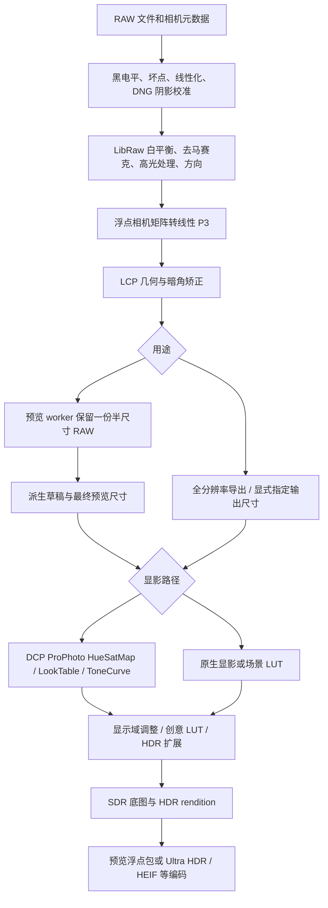

# 图像管线审核与优化：2026-09-21

本次主要问题是预览重复解码，以及镜头矫正的插值质量。DCP 增加了颜色计算，
但它本身没有空间模糊操作。没有证据支持把所有“发糊”都归因于 DCP。
当前修改采用可量化的 CPU 优化，没有更换 RAW 解码器或加入默认锐化。

## 管线与职责



预览在显影前缩小场景图像以控制计算量，因此不能承诺它与全尺寸显影后再缩小逐像素相同。
原生 RAW 显影、DCP 显影与已经显影的 JPEG/HDR 输入仍保留各自的颜色语义。
没有把 DCP ToneCurve 再交给原生场景曲线显影一次，也没有用缩小增益图来掩盖 RGB 细节损失。

## 确认的问题与修复

1. **不同预览尺寸重复 RAW 解码。** `PreviewSession` 原先只缓存两个最终尺寸。
   `preview_max_edge` 进入解码 key，而 LibRaw 对所有 fast preview 都产生相同半尺寸图像，
   改边长仍会重新 unpack、处理、矩阵转换和 LCP。现在 worker 以实际 RAW 参数保存一份 master，
   从中派生尺寸；两份尺寸级图像继续保存分析和模型缓存。DCP、LCP、RAW 参数和源文件仍参与身份检查。
   尺寸级磁盘缓存继续读写，命中时不强制构造 master。大中间图不落盘，非 RAW、独立 preview-frame
   和完整导出的解码策略保持原有语义。

2. **LCP 双线性插值削弱细节。** 改为 4×4 Catmull-Rom 插值，并用源邻域的数值范围限制振铃。
   上限不硬截到 1，下限不硬截到 0，保留场景高光和矩阵负分量。纯暗角校准直接原地相乘；
   零畸变不再经历浮点坐标往返、自动缩放和插值。

3. **DCP 对同一个像素重复采样双光源表。** 相同网格的线性插值与表混合可交换顺序，
   现在先按当前光源权重合成小表，再逐像素采样一次；端点权重直接选择原表。
   原始 profile 不可变，曝光/黑场/LookTable/ToneCurve 顺序不变。

4. **LCP 阶段同时占用已经不需要的 LibRaw 缓冲。** 在复制完像素和元数据后、分配矫正目标前，
   释放 LibRaw RAW/工作 bitmap 和 16 位输出。此项是对象生命周期优化，未测量整进程峰值下降幅度。

解码缓存 schema 从 16 升至 17，渲染 revision 从 8 升至 9，避免继续复用旧插值像素与旧导出状态。

## 实测

输入是项目提供的 Sony ILCE-7RM5 `DSC01925.ARW`，可见区域 9504×6336，
镜头 TAMRON 25–200mm F2.8–5.6 A075 E，拍摄焦距 38 mm、f/4。
使用本机 Lightroom 的 Camera ST DCP 和对应 RAW LCP，显式曝光 0 EV。

Release 前后版本逐一运行，每版三个独立 worker；按面板行为预先提供源文件 SHA-256，
禁用磁盘预览缓存。每个 worker 顺序请求 640 → 1440 → 2048 → 1440。
下表是收到完整浮点预览包的中位墙钟时间，包含解码/处理/管道传输，不包含浏览器绘制和网络。
最终测量期间没有同时编译或导出；早期受编译干扰的数据未用于本表。

| 操作 | 修改前 | 修改后 | 变化 |
| --- | ---: | ---: | ---: |
| 首次 640 草稿 | 1.458 s | 1.525 s | 增加 0.067 s |
| 首次切到 1440 | 1.560 s | 0.254 s | 耗时减少 83.7% |
| 首次切到 2048 | 1.732 s | 0.381 s | 耗时减少 78.0% |
| 返回已缓存 1440 | 0.135 s | 0.127 s | 原有缓存命中速度保留 |

从冷启动到完成 640 和 1440 两帧，中位数之和从 3.018 s 降为 1.779 s，约减少 41%。
首次帧略慢是更高质量插值和保存中间图的代价，不能称为所有操作都加速。
此照片的 half-size RGB float master 是 4752×3168×3×4 字节，约 **172.3 MiB**；
worker 最多保留一份 master，另有原先最多两份尺寸级缓存。大传感器的常驻内存代价会更高。

原始记录保存在忽略目录 `output/pipeline-review/before-final.json`、`after-final.json`。
可使用 `scripts/benchmark_raw_preview.py` 复测：

```powershell
python scripts/benchmark_raw_preview.py photo.ARW --exe build-release/Release/HyperDR.exe --raw-profile camera.dcp --raw-lens-profile lens.lcp --report output/preview-timing.json
```

## 画质与正确性验证

- 44 项 codec-enabled Release CTest 全部通过；3 项跨语言 native 契约测试、24 项 RAW profile/LCP/
  preview worker/preview packet Python 测试通过。
- 实拍完整导出成功：Camera ST + 对应 LCP，Ultra HDR 质量 90，输出 **9504×6336**，
  `half_size=false`、`decode_degraded=false`、`self_verified=true`；解码、处理、编码分别约
  6.812 / 3.149 / 6.928 秒。此为单次最终版本导出，不用于推断导出加速比例。
  结果在 `output/pipeline-review/full-export/DSC01925-hyperdr.jpg`，报告为 `full-export.json`。
- 镜头测试用已知连续正弦/余弦图案，对相同逆畸变坐标的解析值计算误差，
  三次插值 MSE 为双线性的 **0.0275782 倍**。这只说明该测试信号重建更准确，不是实拍锐度提升百分比。
- 验证八种方向、焦距/光圈插值、边框填充、零畸变精确恒等、含负值与 4 倍 SDR 白的阶跃无越界振铃。
- DCP 测试覆盖双光源非恒定三维网格的独立解析参考，原有曝光、编码、色相绕回和色调测试继续通过。
- 实拍 1440 预览的 SDR float plane：不使用 LCP 时，原生默认和 Camera ST 两条路径均与修改前逐值一致。
  这不保证所有 DCP 都逐位一致；提前合表仍有 float 舍入。
- 开启 LCP 时，RGB float 平均绝对差为原生 0.000168、Camera ST 0.000411，
  最大差分别约 0.0744、0.0912，包含插值变化经显影放大后的结果。几何坐标模型未改，不能把这组差值当色差评分。

## 开源实现参考

- [libultrahdr jpegr.cpp](https://github.com/google/libultrahdr/blob/main/lib/src/jpegr.cpp)：
  SDR/HDR intent、增益图生成、压缩封装分阶段，生成增益图有不同成本路径及行任务调度。
  HyperDR 本身已有行并行池；本次重点是消除重复上游工作，没有再加一套线程池。
- [libultrahdr gainmapmath.cpp](https://github.com/google/libultrahdr/blob/main/lib/src/gainmapmath.cpp)：
  插值权重与传递函数提供预计算路径。可借鉴的是把不随像素变化的工作移出内循环；
  增益图重建插值与 RAW 几何 RGB 插值解决不同问题，不能直接互换。
- [RawTherapee dcp.cc 的 makeHueSatMap](https://github.com/Beep6581/RawTherapee/blob/dev/rtengine/dcp.cc)：
  先按白平衡混合光源表，再处理像素，是本次 DCP 优化直接对应的处理思路。实现按本项目结构独立编写。
- [RawPedia 管线说明](https://rawpedia.rawtherapee.com/Toolchain_Pipeline)：
  不同用途的处理管线和固定阶段顺序提供了预览/输出职责划分参考。

以上是审阅时的主分支资料，不是“换成 libultrahdr 就能显影 RAW”：它主要负责 HDR 编码和重建。

## 尚存边界

- 面板仍以半尺寸 RAW 和最多 2048 的预览显示；viewerZoom 只放大已有帧。它不是原始像素 100% 检查器，
  放大后仍可能看起来软。真正的细节检查应另做受可见区域约束的 full-resolution ROI，
  直接把所有交互改成整张 6000 万像素处理会抵消性能收益。本次没有把低分辨率放大冒充原图细节。
- 切换 DCP 或 LCP 会改变解码像素，仍需要重新解码。后续审核已将 profile/base 设置变化纳入预览队列，
  合并连续切换；这不会消除最后选中配置所需的首次解码。
- 未增加去卷积锐化、AI 细节恢复或新的去马赛克算法。没有实体 HDR 屏幕验收，也没有覆盖所有机型、
  鱼眼与色差模型，因此不能宣称存在适合所有输入的“全局最优算法”。

## 后续审核：校准选择与请求调度

第一轮主要处理重复计算和插值；第二轮继续追踪配置切换与显影分支，确认了以下逻辑问题。

1. **相同焦距、光圈的 LCP 校准原先由文件顺序决定。** 实拍镜头的 Adobe LCP 有 495 条记录，
   同一焦距、光圈下包含不同对焦距离及拟合误差。旧选择器会取先遇到的记录；新增回归测试在旧代码上
   以“LCP record order must not choose the calibration”失败。现在分别按畸变、暗角模型的
   `ResidualMeanError` 选择最小绝对误差，再做原有焦距/光圈插值。误差相同时优先远距离校准，
   最后按系数稳定排序。没有可靠的拍摄对焦距离，因此这是缺失距离时的回退策略，不能声称已经按
   实际对焦距离插值。参考 [RawTherapee lcp.cc](https://github.com/Beep6581/RawTherapee/blob/dev/rtengine/lcp.cc)
   中 `calcParams` 按校准质量及拍摄参数选样本的思路；并未照搬其完整选择算法。

2. **基础配置与模型选择绕过预览队列。** DCP、LCP、高光恢复等变化之前直接调用 `load`，
   模型切换直接调用 `optimize`，可与已有预览请求竞争。现在这些设置通过同一个 scheduler 排队，
   立即使旧结果失效，但等待已有调度任务结束后才渲染最新状态。重建原图比较帧的标记在后续滑块事件
   合并时保留；已由队列启动的任务不再清空其执行期间收到的新请求。照片切换仍丢弃旧照片的排队任务。
   手动点击 AI、上传/恢复等入口仍有直接调用路径，本次没有重写整个 UI 生命周期。

3. **AI 底图重复执行场景分析，DCP 执行了不使用的分析。** worker 已经缓存原生场景图的亮度分析，
   AI 底图生成却再次扫描。现在将缓存分析传入共用的底图函数；DCP 分支跳过原生场景分析。
   相关回归验证缓存与现算得到相同底图、增益及曝光。预览与导出仍共享中性的模型输入显影配方。

本轮解码缓存 schema 升至 18，渲染 revision 升至 10，旧校准选择的缓存和导出状态不再复用。
本轮改变的是校准选择与请求逻辑；前文性能表、全尺寸导出记录来自第一轮版本，不作为本轮提速结论。

本轮验证：44 项 Release CTest、3 项 native Python 契约、24 项相关 Python 测试及前端检查全部通过。
将实拍镜头的 495 条 LCP 记录倒序，`DSC01925.ARW` + Camera ST 的 1440×960 SDR float 底图
逐值一致；记录在 `output/pipeline-review/logic/verification.json`。这验证选择确定性，不代表几何精度评价。
新版本另完成 9504×6336 Ultra HDR 导出，`decode_degraded=false`、`self_verified=true`，
报告为 `output/pipeline-review/logic-full-export.json`。未进行浏览器快速连点实测或实体 HDR 屏幕验收。

## 第三轮：按输出需求计算，以及负亮度统计

- **原生 RAW 的 SDR / 零增益路径仍在计算 HDR。** 当 `pop=0` 且只需要 SDR 底图或 HDR 强度为零时，
  旧实现仍扫描场景、生成高光增益网格、做局部环境与导向滤波，再把增益乘零。
  现在只计算曝光和底图；自动曝光复用已有全局统计或单独测光，手动曝光无需分析。
  `pop>0` 时仍保留其需要的局部分析，实际启用 HDR 时才生成增益准备数据。
  S-Log3 LUT 的曝光步骤也复用同一测光函数，不再为了曝光生成完整的 HDR 分析网格。
  此优化针对原生场景显影；DCP 的显影路径没有因此更换算法。
- **一个负亮度单元可以污染整个局部增益计算。** `log2(scene_luma + epsilon)` 对负值产生 NaN，
  后面的 clamp 并不能消除它。16×16 的最小回归在旧代码上失败，权重统计非有限。
  现在仅在对数统计入口将亮度下限设为零；源 RGB 和正亮度计算保持原样。
  回归同时检查邻近正常高光、有限增益和与黑电平统计下限的一致性。
  这是已复现的数值错误，但没有证据表明它导致了所提供 ARW 的观感问题。

新增渲染回归覆盖自动/手动曝光、SDR 与 HDR 底图逐值一致、零增益两个端点一致，以及
`0 → 1 → 0` 增益切换后的缓存正确性。渲染 revision 升至 11；解码像素和缓存 schema 不变。

验证通过 44 项 Release CTest 和 3 项 native Python 契约测试。另用 `DSC01925.ARW`、
原生显影、无 DCP/LCP、2048 预览、`pop=0`、零增益测量；每个版本、输出目标各启动三个 worker，
顺序请求曝光 `0 / +0.25 / -0.25 / 0 EV`。全部 48 帧按目标和曝光比较，像素 payload SHA256
一致。排除首次解码帧后，每组九次请求的中位墙钟时间如下，包含完整浮点包传输，不含浏览器：

| 输出目标 | 修改前 | 修改后 |
| --- | ---: | ---: |
| SDR JPEG 预览 | 124 ms | 92 ms |
| Ultra HDR 零增益预览 | 155 ms | 120 ms |

记录为 `output/pipeline-review/demand-verification.json`。这不是 DCP 性能或首次解码速度的结论；
本轮未再次执行全尺寸实拍导出，前文全尺寸结果对应第二轮版本。

## 第四轮：重采样覆盖面积与 gamma 契约

缩图存在可复现的能量偏差：`[0,0,0,0,1]` 从 5 像素降为 1 像素时，旧实现输出 0.5，
源均值实际为 0.2。原因是奇数尺寸减半后，末端单个像素与其他两个像素的平均值具有相同权重，
后续双线性缩放也没有覆盖完整的输出像素面积。`[0,1,0]` 从 3 降为 2 时同样低估亮点覆盖率。

现在保留逐级低通的策略，但每一级缩小都按等面积的输出像素计算源像素覆盖权重；
偶数尺寸的精确二分保留快速求平均，放大轴仍使用中心对齐的线性插值。测试覆盖奇数边缘、
非整数比例、横/纵独立缩放、均值能量、负通道、HDR 高光及大坐标精度。
3201 像素的交替条纹参考均值修正为 1600/3201，而非 0.5；后者并非该奇数图案的真实均值。
面积缩小的依据可参见 [OpenCV 的 INTER_AREA 定义](https://docs.opencv.org/4.13.0/da/d54/group__imgproc__transform.html)。
这里没有引入 OpenCV 依赖，也不声称面积滤波能消除所有频率的混叠，或等价于理想带限重建。

重采样会影响预览和模型张量，因此 decode cache schema 升至 19，渲染 revision 升至 12。
模型输入报告与外部增益绑定采用 `uniform-area-stages/linear-upscale-v2`，旧约定的绑定明确拒绝，
避免用新底图搭配旧预处理生成的模型增益。现有模型权重及冻结的训练数据没有重写。

部署缓存的 `--resume` / `--reuse-input-dir` 原先仅凭 tensor 文件存在就复用，而且 resume 会丢失
原始 model-input 报告。现在验证生成器可执行文件摘要、long-side、高光恢复模式、原始源和实际
fallback 源摘要、tensor 摘要及形状。缺失或不匹配则重新生成；有效复用保留完整报告与 fallback 来源。
没有修改任何实际部署缓存或训练集目录。

另修复一个 gamma 边界错误：元数据校验接受有限正 gamma，重建却将小于 1e-6 的值抬至 1e-6。
`gamma=1e-7`、gain code=0.9999998807907104、范围 [0,2]、base=0.25 时，
旧输出约 0.855740，按编码的逆公式应为约 0.380817。现在使用已验证的实际 gamma。
独立 double 精度解析测试覆盖单通道和 RGB 不同 gamma，明确检查有限值。
公式与 [libultrahdr applyGain](https://github.com/google/libultrahdr/blob/main/lib/src/gainmapmath.cpp) 一致；
偏移量及正常 gamma 的适配没有发现额外反转问题，未据此改写它们。

本轮验证：44 项 Release CTest、3 项 native Python 契约、28 项相关 Python 测试全部通过。
实拍 DCP+LCP 的 9504×6336 显影图成功生成 512×352 模型输入，像素有限且在 [0,1] 内，
报告记录新缩图约定（`output/pipeline-review/resample-model-input.json`）。
独立 worker 三次测量的 640 / 1440 / 2048 / 缓存1440 中位耗时，修改前为
1.431 / 0.232 / 0.360 / 0.124 秒，修改后为 1.438 / 0.229 / 0.358 / 0.128 秒。
记录在 `resample-before.json`、`resample-after.json`；没有明显性能退化，也不把小幅波动解释成加速。

## 第五轮：PNG 颜色解释、线性缩图与 ICC 色域

这一轮发现的是栅格解码路径的问题，不能据此认定它们造成了实拍 RAW 的卡顿或发糊。

- PNG 只识别 ICC/cICP，并统一让 ICC 优先。现在按
  [W3C PNG 3 的颜色标签优先级](https://www.w3.org/TR/png-3/#11colorinfo)
  处理 `cICP > iCCP > sRGB > cHRM/gAMA`。cICP 交给 libpng 校验、读取；旧版 libpng
  使用其校验过的 unknown chunk，不再直接扫描未经 CRC 验证的字节。
- 显式 `gAMA=1` 的 8 位中灰原先被解成约 0.215861，现在为约 0.501961。
  显式 sRGB 红色不再被默认 P3 覆盖；cHRM 的原色及白点通过 LCMS 转换。
  PQ/HLG 与兼容 ICC 同时存在时，像素、domain、headroom 均使用较高优先级的 cICP。
- PNG 预览原先先平均编码整数，再解码 transfer。黑白条纹得到约 0.215861 的线性灰，
  实际线性均值应是 0.5。现在先将每行转成线性 P3，再按等面积覆盖缩图，保留浮点精度。
  源行以 64 行批次解压、并行转换，避免全图浮点临时副本，也避免串行 ICC 计算成为瓶颈。
  Adam7 的完整编码栅格通过同一缩图算法处理，切换交错存储不会更换预览滤波核。
- ICC 转 P3 的末端原先强制 `max(0, channel)`。Rec2020 纯绿在 P3 中约为
  `[-0.282180, 1.075788, -0.019599]`，这些负数代表工作色域外的颜色，并非可忽略噪声。
  现在与矩阵路径一致地保留负分量，由后续显影负责色域映射。

PNG 读取的 longjmp 只跨越 libpng 调用和平凡局部变量，颜色转换及其 C++ 资源位于外层。
完整图、预览、截断文件均经过回归；同时检查 16 位中间码值的字节序、灰度 ICC、
跨 64 行边界的面积守恒、奇数尺寸、Adam7、实际返回尺寸和非降级预览标记。
ICC 独立回归先在旧实现上失败，修复后通过，涵盖 10/12/16 位归一化与广色域负分量。
五组 PNG 颜色/缩图回归也已在旧实现上确认失败。

本轮通过 46 项 Release CTest 和 3 项 native Python 契约测试。后续补充的 PNG 灰度 ICC、
有限值检查通过同一目标的增量构建与运行。decode cache schema 升至 20，渲染 revision 升至 13，
已有持久解码和导出续跑不会继续复用旧颜色解释。

使用实拍导出的 SDR JPEG 制作 6000×4000、带 ICC 的 PNG，分别启动 CLI 三次。
修改前基线为保留的 `HyperDR-resample-baseline.exe`，该基线也早于第四轮公共缩图修复；
数值对比不用于隔离公共缩图本身的耗时。墙钟中位时间如下：

| 操作 | 修改前 | 本轮最终版本 |
| --- | ---: | ---: |
| 1440 边长 thumbnail | 0.732 s | 0.746 s |
| 全尺寸解码并生成 512 模型输入 | 1.144 s | 1.133 s |

记录在 `output/pipeline-review/png-benchmark.json`，含各次测量和中间串行版本的结果。
最终预览三次为 1.794 / 0.746 / 0.724 秒，存在一次首轮慢样本；这里仅报告中位数，
不声称冷启动或所有 PNG 都更快。本轮没有再次测量 RAW，也没有改变 RAW 解码逻辑。

仍有明确边界：窄范围 cICP PNG 现在返回不支持错误，避免把视频码值误作全范围；
尚未实现其扩展范围传递函数。超预算 Adam7 仍需拒绝，透明度背景合成与 PNG Exif 方向
不在本轮修复范围。下面的整体验收项目仍需继续推进。

## 第六轮：模型增益与 RAW 校准的配对

外部模型绑定原先只核对源文件、DCP/LCP、高光恢复与裁剪，遗漏 RAW 数字增益、自动坏点、
暗场/坏点图/线性化/阴影校准、默认色域、底图色域压缩及显影版本。旧实现确实接受了
“同一 RAW、不同 digital_gain”的增益；新增回归在修复前失败。

现在 `model-input/v2` 写出预处理指纹和 pipeline revision，Python 推理将指纹传递到
`model-gain-binding/v2`，回放时重新核对。指纹复用集中声明的解码设置及六类 RAW 资源列表，
资源按内容摘要识别，移动同内容文件不必重新推理；原地改写校准文件则必须重新生成。
半尺寸/输出边长不参与颜色身份，仍独立校验原始 sensor、裁剪原点和实际交付尺寸。
底图的曝光和显影参数继续按冻结配方重放，输出格式及 JPEG 质量不会误使绑定失效。
旧 v1 模型绑定缺少完整预处理身份，需要重新生成；通用非绑定 signed-gain 文件格式不变。

同时修复两个回放问题：

- 全尺寸模型绑定原先不能用于 `--fast-preview`，而反方向的半尺寸绑定用于全尺寸导出却可以。
  现在两个方向均可在明确的预览/导出意图及相符几何下工作；半尺寸图仍不能冒充全尺寸最终导出。
- 原生 HDR 输入报告发出 `display-hdr-split` 配方，绑定读取器却不接受该名称。现在支持此配方，
  并核对配方与实际输入域/DCP 状态，避免场景与显示域混用。

`model-input` 也补齐了坏点图、暗场、线性化 LUT、自定义阴影图四个文件参数，能生成与实际
校准配置对应的模型底图。渲染 revision 升至 14，解码像素未改变，decode cache schema 保持 20。

实际闭环使用 `DSC01925.ARW`、Sony DCP、Tamron LCP、RAW gain=1.25 和一份显式恒等阴影图：
全尺寸 9504×6336 解码 → 512×352 模型输入 → 现有 production-v3 checkpoint 的 CPU 推理 →
640 快速预览 → Ultra HDR 导出。导出报告确认全尺寸解码、未降级、self_verified=true；
本次指定输出为 512×341，不能据此声称本轮再次完成了 6100 万像素编码。
修改 RAW gain 为 2 或原地将阴影图从 1 改为 1.1，均在回放时拒绝旧增益，没有生成错误预览。
文件及各阶段返回码记录在 `output/pipeline-review/binding-v2/`，校准文件验证后已恢复。

回归覆盖六类校准文件的加入、移动和原地修改，以及默认色域、坏点模式、旧版本身份、
合法的双向分辨率复用、非法降级导出和 HDR 配方。46 项 Release CTest、3 项 native 契约和
4 项部署缓存测试全部通过；没有修改模型权重、训练集或实际部署缓存。

本轮还逐函数核对了 RAW callback：LUT/dark/black/DNG GainMap 校准后重置 LibRaw 黑白电平，
自定义 shading 的整数缩放在浮点输出中恢复，digital_gain 应用一次；DNG GainMap 或自定义
shading 存在时关闭 LCP vignette，几何矫正仍执行。尚无证据显示这里重复调用或漏乘比例。
但 DNG GainMap 与自定义 shading 目前相乘，只有 LCP vignette 被去重；两份绝对阴影校准
是否应叠加取决于自定义图的语义，这一组合尚未用真实校准样本验收。

## 第七轮：窄范围解码和局部增益边缘

PNG 的窄范围 cICP 原先直接报不支持；现支持 8/16 位 RGB，先按视频黑白电平
归一化，再解码 transfer。8 位参考黑/白是 16/235，16 位是 4096/60160。
依据 [PNG 3 的 cICP 扩展范围建议](https://www.w3.org/TR/png-3/#11cICP)，
低于参考黑及高于标称白的信号均保留，负值使用 transfer 的奇延拓。
例如线性 8 位码值 0/16/128/235/255 对应约 -0.073059/0/0.511416/1/1.091324，
不会预先裁剪成 0–1。P3 恒等转换也移除了与其他原色路径不一致的负值裁剪。

HLG 的逆 OETF 保留符号，随后按整个像素的有符号场景亮度计算 `abs(Ys)^(gamma-1)`；
没有对每个颜色通道单独施加 system gamma。这里核对了
[Colour 的 BT.2100 参考实现](https://colour.readthedocs.io/en/develop/_modules/colour/models/rgb/transfer_functions/itur_bt_2100.html)。
原有非负 HLG 输入行为不变，新增负场景值不会因分数次幂产生 NaN。

新增回归在修复前确认失败，覆盖 8/16 位、linear/sRGB/BT709/PQ/HLG、参考黑白、
低于黑位、高于白位、带兼容 ICC 的优先级和线性缩图均值；混合正负 HLG 另用独立
双精度参考数值核对。decode cache schema 升至 21，render revision 升至 15。

PNG Exif 的结论与最初设想不同：[规范的 eXIf 说明](https://www.w3.org/TR/png-3/#eXIf)
指出它可能仅记录编辑前的历史信息，不能默认仍对应当前像素。因此本轮没有自动套用
Exif Orientation；“未旋转 PNG”本身不能直接定性为方向错误。照片字段传递仍未补齐。

局部增益另外用临时 C++ 程序直接链接 Release 库量化：同一中线阶跃，左侧场景值 0.02、
右侧 8，宽度为 640/1280/2048，固定曝光、headroom=3、pop=0。

| 条件，单位 stops | 640 | 1280 | 2048 |
| --- | ---: | ---: | ---: |
| 默认 diffuse floor=.35，最后暗像素 | 0.44052 | 0.54761 | 0.57604 |
| 默认，首个亮像素 | 1.32155 | 1.64282 | 1.72813 |
| 默认，远亮区 | 0.83478 | 0.83478 | 0.83478 |
| floor=1，最后暗像素 | 0.58837 | 0.58837 | 0.58779 |
| floor=1，首个亮像素 | 1.76511 | 1.76511 | 1.76337 |
| floor=1，远亮区 | 2.38508 | 2.38508 | 2.38508 |

所有尺寸从倒数第二个暗像素开始增益均为零，SDR 底图阶跃清晰。一像素泄漏主要来自
半尺寸增益图双线性插值，默认设置的尺度差异还包含局部高光权重的影响。
这说明紧邻高反差边缘存在光晕风险；没有发现重复 guided filter 或大范围底图模糊，
也不能把这一合成阶跃的结果当作实际 RAW 发糊的根因。程序及完整剖面存于
`output/pipeline-review/local-gain-edges/`，本轮未调整局部增益算法。

## 第八轮：栅格缩图与模型绑定的尺寸语义

JPEG、HEIF、AVIF 在解码阶段缩小后，把缩图宽高同时写入原始尺寸和请求尺寸。
全尺寸生成的模型增益因此不能用于同一张照片的快速预览。用实际 JPEG、现有
production-v3 checkpoint 和 `preview-frame` 复现，修复前返回
`model binding mismatch: sensor raster`。

现在 JPEG/AVIF 保存缩小前的存储尺寸，HEIF 用原始 ispe 尺寸；target 记录完整的
方向归一化区域，decoded 才记录实际解码交付尺寸。现有 codec 回归增加旋转 JPEG
以及单图 PQ/HLG HEIC、AVIF 的缩图尺寸断言，保留原有 HEIF 方向回归。

`preview-frame` 现在始终声明 Preview 意图，不再依赖 `--fast-preview` 才脱离 Export
校验。对于显示域栅格的完整绑定，允许解码器在两轴使用同一整数因子缩小，兼容各解码器
向上/向下取整；源文件、原始尺寸、裁剪原点和颜色预处理仍需匹配。RAW 仍按其固定
半尺寸显影检查，最终导出仍拒绝缩图冒充完整交付。

新增缩图回归还发现 AVIF 的实际崩溃：`avifImageScale` 收到空 diagnostics 指针，而当前
libavif 会在入口直接清空该结构的错误字符串。现在传入有效的栈对象。此前完整尺寸
AVIF 回归不会进入这一分支，因此没有暴露它。
HEIF 的断言也区分了编码填充栅格和有效区域；原有带 Exif 方向的 Adaptive HDR 夹具
刻意不在解码阶段缩小，不能用它冒充单图 HEIC 的缩图覆盖。

这一轮与第七轮合并采用 decode schema 21 / render revision 15。实际闭环脚本和记录位于
`output/pipeline-review/raster-binding/`，旧版失败日志另存为 `jpg-preview-before.log`。
修复后 JPEG 和 PNG 均完成完整模型输入 → production-v3 CPU 推理 → 32 边长预览，
不需要 `--fast-preview`。同一 JPEG 也成功导出 Ultra HDR：报告确认存储尺寸 1025×513、
方向归一化后的实际解码 513×1025、未降级、self_verified=true；本次输出为 16×32，
验证的是完整解码与缩小输出的语义，并非大尺寸编码性能。

另一个待处理点是 HEIF/AVIF 的解码后缩图仍发生在编码值域，接下来需要像 PNG 一样
核对高反差纹理的线性均值，并在内存约束下调整处理顺序；本轮几何修复未改变它们的滤波。

最终 Release 构建及全部 46 项 CTest 通过，3 项 native Python 契约测试通过。
验证日志分别为 `.workbuddy/raster-final-build.log`、`.workbuddy/raster-final-ctest.log`；
模型输入、推理、预览和导出的实际记录见上述 raster-binding 目录。

## 第九轮：HEIF/AVIF 线性缩图与共享颜色转换

确认了上一轮留下的处理顺序问题。对同一张已压缩的 64×32 黑白棋盘，分别完整解码和
缩小解码到 8×4，得到以下线性 RGB 均值；比较同一压缩文件，排除了编码量化本身的差异。

| 格式 | 完整解码均值 | 原缩图均值 | 修复后缩图均值 |
| --- | ---: | ---: | ---: |
| HEIC PQ | 0.501241 | 0.000000225 | 0.501241 |
| HEIC HLG | 0.499041 | 0.000000118 | 0.499041 |
| AVIF PQ | 0.499787 | 0.0436921 | 0.499787 |
| AVIF HLG | 0.499628 | 0.124719 | 0.499628 |

原 HEIF 路径出现严重混叠，AVIF 路径则在非线性编码值上缩图，均不能保持亮度能量。
现在保留完整解码的 RGB 整数缓冲，逐行转换到线性 P3，再按像素面积覆盖求均值。
HEIF/AVIF 不再调用各自的编码值域缩图函数；内存中只建立目标尺寸的浮点图和各工作线程
的一行临时浮点数据。完整整数解码缓冲仍然存在，这不是常量总内存或流式解压承诺。

PNG 原有的行转换提取成共享 `RgbRowTransform`，JPEG/PNG/HEIF/AVIF 共用位深归一化、
ICC、原色转换和整数码值查找表。10/12 位 ICC 输入先归一化到 LCMS 的 16 位整数范围；
PNG 的灰度 ICC、窄范围和负值行为保留。HLG 只把逐通道 inverse OETF 放入查找表，
每个像素仍使用完整 RGB 的亮度计算 OOTF，然后才转换原色、缩图。

PNG/HEIF/AVIF 同时共用缩图尺寸规划，统一向上取整。例如 513×257 请求解码边长 257，
现在规划和交付均为 257×129，不再出现“规划满足 257、实际只交付 256”的偏差。
模型绑定检查同步采用相同取整规则；旧缓存通过 schema 22 / render revision 16 失效。

除四编码真实文件回归外，直接颜色转换回归覆盖 8/10/12/16 位、ICC/矩阵两条路径、
带 padding 的行 stride、19×11→3×2 的末行/末列面积及有符号 P3；PNG 原有回归全部通过。
最终 Release 全部 46 项 CTest、3 项 native Python 测试通过，补充的有限值检查亦单独通过。
日志为 `.workbuddy/linear-raster-ctest.log`，修复前后棋盘数值分别保存在
`.workbuddy/hdr-linear-preview-red.log` 与 `.workbuddy/hdr-linear-preview-green.log`。

性能样本由 1440×960 照片放大至 3000×2000，再编码成单图 PQ HEIC/AVIF；它用于测量
600 万像素输入的处理开销，不用于宣称原生 600 万像素照片的细节质量。相同文件各运行
三次独立 thumbnail 命令，输出 1024×683，测量期间无并行构建或其他测试。

| 格式 | 原版中位耗时 | 新版中位耗时 | 原版/新版峰值工作集约值 |
| --- | ---: | ---: | ---: |
| HEIC | 0.286 s | 0.243 s | 142 / 142 MiB |
| AVIF | 0.275 s | 0.255 s | 251 / 251 MiB |

新版 HEIC 三次为 1.303 / 0.243 / 0.240 秒，有一次明显较慢的首次运行；因此不据中位数
承诺稳定加速或冷启动改善。完整命令、各次耗时与 Windows 峰值工作集记录位于
`output/pipeline-review/linear-raster-benchmark/`。

另外用 JPEG、PNG、PQ HEIC、PQ AVIF 各完成：完整模型输入 → production-v3 CPU 推理 →
128 边长预览 → Ultra HDR 导出。四份导出报告均确认 self_verified=true、decode_degraded=false；
这是完整解码与小尺寸输出的功能验证，不是全尺寸编码性能测试。脚本及记录位于
`output/pipeline-review/linear-raster-binding/`。以上证据针对栅格路径，未把结果外推为 RAW
发糊的根因已经解决，局部增益边缘、校准组合及下表其余验收范围仍保留。

## 总体正确性的验收范围

当前仍不能用上述回归通过来证明“整个管线已经没有问题”。持续审核按以下不变量推进：

| 环节 | 必须成立的不变量 | 已有证据及剩余范围 |
| --- | --- | --- |
| RAW 解码与校准 | 黑白电平、白平衡、矩阵和方向各应用一次；全尺寸导出不静默降级 | 有 RAW/DNG/DCP 测试及实拍导出；尚需继续核对不同校准组合和机型路径 |
| 镜头与重采样 | 坐标随方向一致；恒定场和线性均值不偏移；有符号场景值不提前裁剪 | 镜头方向、恒等、插值解析测试及本轮缩图回归；尚未覆盖全部真实镜头类型 |
| 栅格颜色解码 | 显式颜色标签优先于默认值；颜色转换先于线性缩图；保留工作色域外分量 | PNG 颜色/窄范围、ICC、HEIF/AVIF 线性缩图已修复并做真实编码回归；透明度与 PNG 照片字段传递尚待核对，Exif 不默认控制方向 |
| 场景/显示域显影 | 成片输入不再次当 RAW 显影；DCP 与原生曲线不重复应用 | domain routing、DCP、LUT、rendition 回归；各格式与 LUT 组合仍需系统核对 |
| 局部增益 | 负值不产生 NaN；零增益不改变底图；缓存切换与现算一致 | 负亮度回归、0→1→0 回归、原生渲染测试及多尺寸阶跃剖面；有一像素增益泄漏，真实照片边缘与尺度差异尚需验收 |
| 增益编码与重建 | gamma/offset/channel/headroom 语义一致；量化误差可测 | 解析重建、RGB endpoint 和 codec 测试；不同封装器与显示容量的交叉验证仍在继续 |
| 预览与导出 | 同配置共享处理语义；像素尺寸、采样差异明确；旧结果不覆盖新结果 | native worker、scheduler、绑定测试及基准；没有用缩图逐值比较代替完整格式验证 |
| 模型与持久缓存 | tensor、源图、预处理、生成器和配对目标来源一致 | 已升级缩图和预处理绑定、解码缓存及部署复用；有实拍输入→推理→预览/导出闭环，未重新训练或重建完整数据集 |

上述“剩余范围”是尚未完成的验收，不等于已确认错误；后续结论须以实际代码和独立验证补齐。
